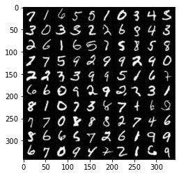
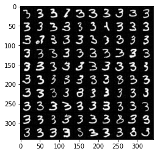
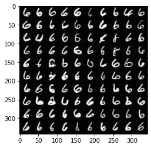

# Diffusion models

* Implementation of diffusion models using stochastic differential equations (SDE)
* Conditional and unconditional generation of MNIST digits
* [Model](./diffusion.py ), [SDE](./ddpm_sde.py ), [Generation examples](./conditional_sampling.ipynb)

### Example of unconditional generation

### Example of conditional generation

---
---

# Диффузионные модели 

* Реализация диффузионных моделей с помощью аппарата стохастических дифференциальных уравнений (SDE)
* Условная и безусловная генерация цифр MNIST 
* [Модель](./diffusion.py), [SDE](./ddpm_sde.py), [Примеры генерации](./conditional_sampling.ipynb)

### Пример безусловной генерации

### Пример условной генерации

