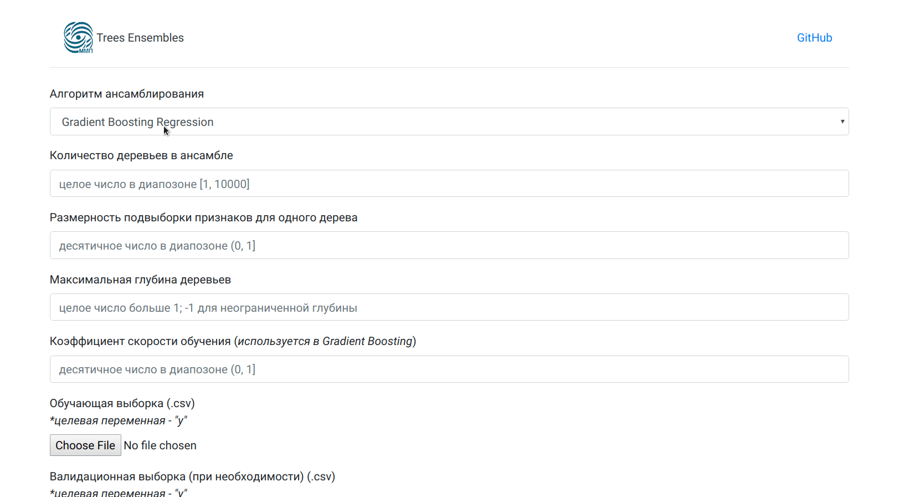

# Простой Flask сервер с ML моделью 

В данном учебном проекте реализован простой сервер на Flask с возможностью обучения модели.

Функционал сервера:
- Запуск из *docker* контейнера
- Возможность выбора базовой модели (Random Forest или Gradient Boosting) и настройки гиперпараметров
- Загрузка датасета 
- Просмотр табличных данных и кривой обучения

[Отчет](./Ensembels.pdf) &emsp; [Скрипты для запуска](./scripts/) &emsp; [Ноутбук с экспериментами](./trees.ipynb)  

## Пример работы сервера

##  Запуск сервера 

- Установить `Docker`
- Склонировать репозиторий `$ git clone https://github.com/PavelShtykov/trees_ensembles_prac`
- Собрать сервер `$ bash build.sh`
- Запустить сервер `$ bash run.sh`

Также сервер доступен на [DockerHub](https://hub.docker.com/repository/docker/shtykovpavel/server-test)

---

# Simple Flask server with ML model

In this tutorial, we implemented a simple Flask server with the ability to train a model.

Server functionality:
- Run from *docker* container
- Possibility to choose the base model (Random Forest or Gradient Boosting) and adjust the hyperparameters
- Download dataset
- View tabular data and learning curve

[Report](./Ensembles.pdf) &emsp; [Scripts to run](./scripts/) &emsp; [Notebook with experiments](./trees.ipynb)

## Server example

## Start the server

- Install `Docker`
- Clone repository `$ git clone https://github.com/PavelShtykov/trees_ensembles_prac`
- Build server `$bash build.sh`
- Run server `$bash run.sh`

The server is also available on [DockerHub](https://hub.docker.com/repository/docker/shtykovpavel/server-test)
