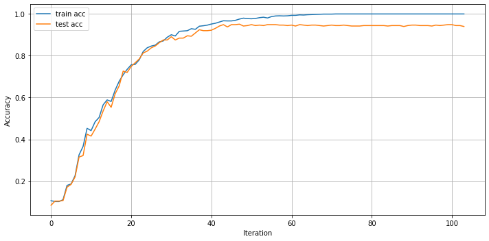
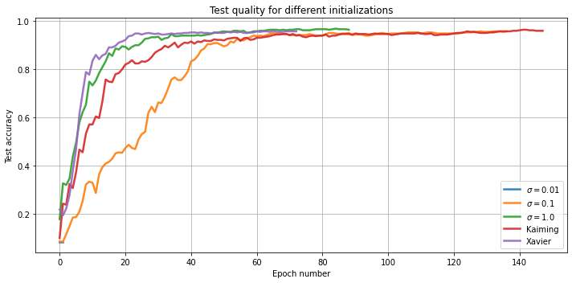
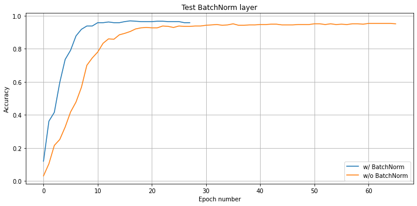

# Реализация полносвязной NN 

В данном учебном проекте был реализован простой фреймворк построения и обучения нейронных сетей на `Numpy` и `Scipy`. 

[Ноутбук](./NN.ipynb)

Функционал:
- *Слои:* FC, ReLU, Tanh, Sigmoid, BatchNorm, DropOut, SoftMax
- Автоматическое вычисление *градиентов*
- Обучение *BackProp'ом*

## Несколько графиков с экспериментами по классификации рукописных цифр (датасет `digit`):

### Кривая обучения 3-х слойной сети

### Сравнение разных стратегий инициализации

### Влияние BatchNorm на процесс обучения

