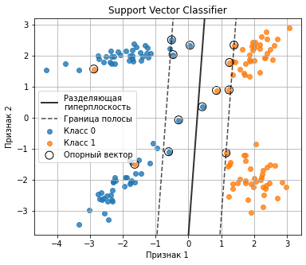
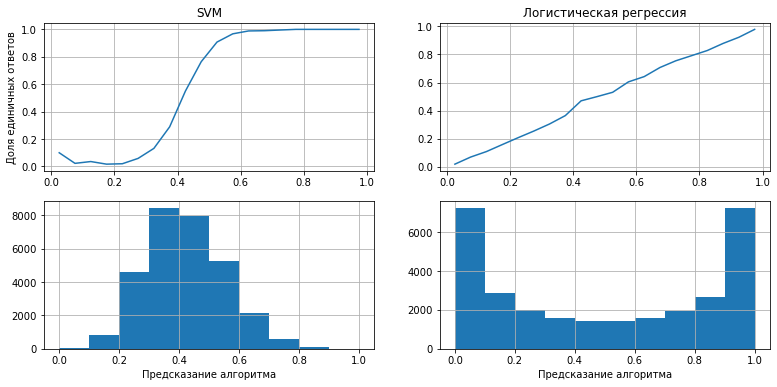
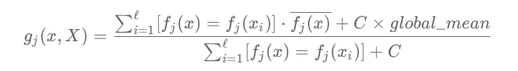

# SVM и LogReg с отбором признаков

В данном ноутбуке разобраны некоторые методы предобработки признаков, работы с категориальными переменными, построения SVM и LogReg'a и анализа ошибок.

[Ноутбук](./svm_notebok.ipynb)

## Некоторые примеры 

### Визуализация гиперплоскости SVM



### Визуализация вероятностей SVM и LogReg'a



### Реализация счетчика со сглаживанием



```Python
def target_encoder_smooth(X_train, y_train, X_test, columns, C=10):
    df = pd.concat([X_train, pd.Series(y_train, name='y', index=X_train.index)], axis=1)
    
    X_train_res = X_train.copy()
    X_test_res = X_test.copy()
    glob_mean = df['y'].mean()
    for col in columns: 
        agg = df.groupby(col)['y'].agg(['mean', 'count'])    #Считаем статистику только на трейне!
        means = (agg['count'] * agg['mean'] + C * glob_mean) / (agg['count'] + C)
        
        X_train_res[col] = X_train_res[col].map(means)
        X_test_res[col] = X_test_res[col].map(means)
        
    return X_train_res, X_test_res
```
